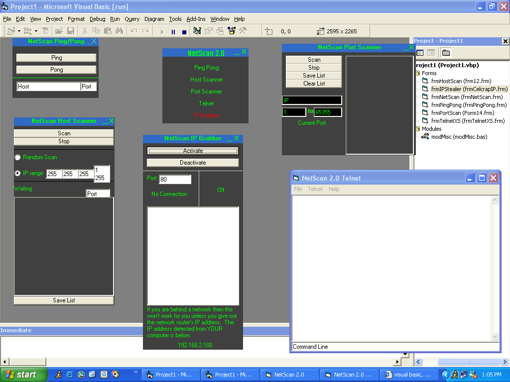



## NetScan 2\.0 \- Debugged, 5 apps

### Description

This is NetScan 2.0. It has a totally new look to it, i fixed my form moving code, debugged my apps, enhanced them, and added the Ping/Pong Form. This is a major improvement on my NetScan set of network tools because now, they work. Ping/Pong Gives you a response time, a 10 second time-lease for remote host responses, and error protection. My host scanner is a lot less efficient than i would like it to be. I am working on something to where it would load a timer for each host and try to connect for a certain amount of time. My Port Scanner works, its fast, and extremely efficient. My Telnet Client has improved, is sizeable now, has tutorials, and the option to listen on a port too. It generates HTML Logs now also. The IP Grabber is pretty much the same but it gives a warning about being behind networks, it gives you your IP address, the status, and phase of IP grabbing. Votes would be great and hang around for NetScan 2.0.1, the rebuild, with NetStat. Votes, suggestions, and comments would be great. Please also try to find bugs, I haven't found beta testers.
 
### More Info
 

             |
---                |---
**Submitted On**   |2004-02-22 13:02:46
**By**             |[Corey langdon \(has since resigned\)](https://github.com/Planet-Source-Code/PSCIndex/blob/master/ByAuthor/corey-langdon-has-since-resigned.md)
**Level**          |Intermediate
**User Rating**    |5.0 (10 globes from 2 users)
**Compatibility**  |VB 6\.0
**Category**       |[Miscellaneous](https://github.com/Planet-Source-Code/PSCIndex/blob/master/ByCategory/miscellaneous__1-1.md)
**World**          |[Visual Basic](https://github.com/Planet-Source-Code/PSCIndex/blob/master/ByWorld/visual-basic.md)
**Archive File**   |[NetScan\_2\_1712022222004\.zip](https://github.com/Planet-Source-Code/corey-langdon-has-since-resigned-netscan-2-0-debugged-5-apps__1-51933/archive/master.zip)

